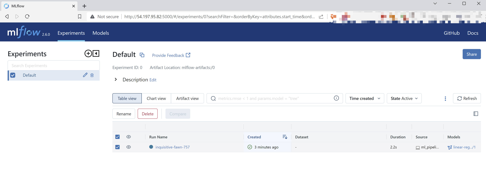
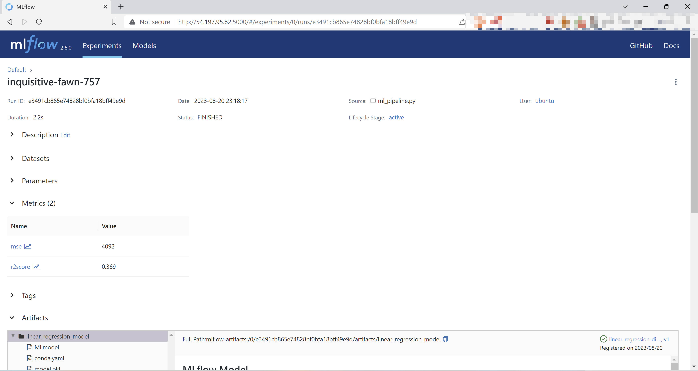
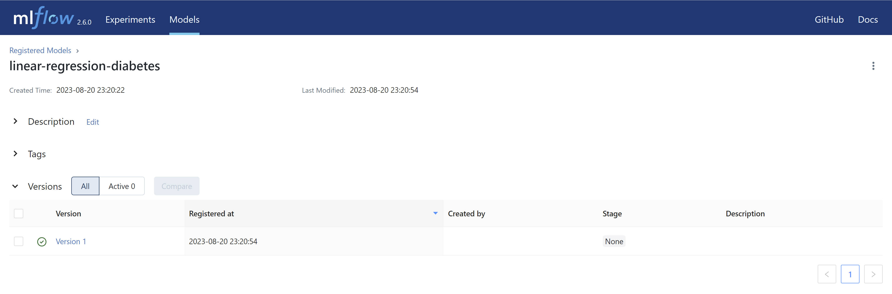
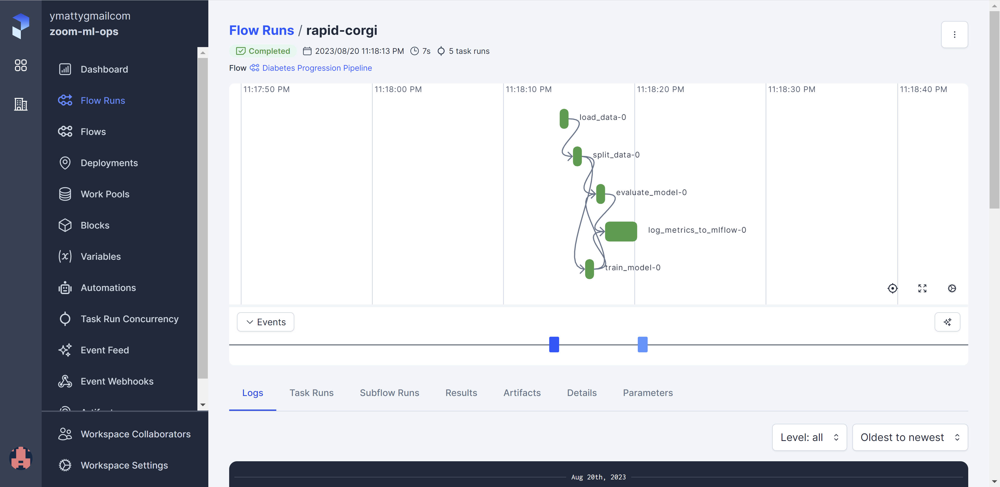

# MLOps Project: Operationalizing Linear Regression Model

## Welcome
This repository serves as a comprehensive guide and demonstration of how to operationalize a linear regression model using various tools and concepts learned from the [MLOps Zoomcamp by @DataTalks.Club](#datatalksclub-mlops-zoomcamp-team). The goal of this project is to leverage a toy dataset (diabetes data) from scikit-learn and demonstrate the end-to-end process of transforming a machine learning model into a production-ready application.

## Project Overview
In this project, we operationalize a linear regression model using a set of carefully orchestrated steps. The main components and steps of the project include:

1. **Terraform Configuration:** We provide a Terraform configuration that provisions an EC2 VM on AWS. This VM comes equipped with essential tools such as Git, Docker, and an MLflow server.

2. **Dockerized MLflow Server:** The EC2 VM runs an MLflow server within a Docker container. This enables efficient tracking and management of machine learning experiments and their associated metrics.

3. **Pipenv and Dependency Management:** We offer a defined Pipenv configuration to ensure a consistent and isolated Python environment. This environment includes all the necessary dependencies to execute the project's code seamlessly.

4. **Linear Regression Model Training:** The heart of the project involves training a linear regression model on the [diabetes dataset](#diabetes-dataset). We provide Python scripts that load the required dependencies and execute the model training process. The linear regression model training is based on [@DataProfessor's YouTube tutorial and jupyter notebooks](#dataprofessors-linear-regression-lesson). Refactored and operationalized using techniques learned in [MLOps Zoomcamp](#datatalksclub-mlops-zoomcamp-team)

5. **Prefect Workflow:** A Prefect workflow is defined to ensure the execution of different model training steps in an orchestrated manner. This adds a layer of automation and control over the entire process.

6. **Experiment Tracking/Metrics Logging:** Throughout the model training process, essential metrics and performance indicators are logged to the MLflow server. This enables effective monitoring and analysis of the model's behavior.

## Prerequisites
Before proceeding, ensure you have the following prerequisites set up:
1. AWS Account: You need access to an AWS account to deploy resources using Terraform.
2. Configure AWS cli credentials
3. Terraform: Install Terraform to provision the infrastructure. ([info here](https://developer.hashicorp.com/terraform/tutorials/aws-get-started/install-cli))

## Launch steps

#### Launch Terraformed VM
 1. Clone this repository & navigate to terraform directory
```bash 
# Clone the GitHub repository
git clone https://github.com/directdetour/MLOps-Project.git
cd MLOps-Project/terraform
```

2. initialize and execute terraform configurations. (This will create an EC2 VM and checkout this repository on the newly created VM, then connect via SSH) 

```bash
terraform init
terraform plan
./apply_and_ssh.sh
```

- If the VM is already launched, I've added a helper script to SSH to the VM based on terraform outputs.
```bash
./vm_ssh.sh
```

#### Using the active VM connected via SSH:
**Important Note:** You may need to wait for the VM to completely initialize (2-3 minutes possibly)
  ```bash
  # check logs to see initialization status
  sudo cat /var/log/cloud-init-output.log 
  ```

1. Navigate to project 
  
  ```bash
  cd MLOps-Project
  ```

2. Configure prefect environment variables (execute helper script and provide your configurations for [Prefect cloud account](#prefect-cloud-account))

  ```bash
  source ./prefect_settings.sh
  ```

3. Model Training: Execute model training pipeline script

  ```bash
  ./model_train_pipeline.sh
  ```

4. **Access Mlflow UI**:
   - Open a web browser and navigate to: `http://public-ip-of-ec2:5000` (replace with the actual IP address and link provided by the SSH scripts).
   - You should now be able to view and monitor the logged metrics and model details.
   
   
   
   

5. **Access Prefect Cloud**:
   - Log in to [https://app.prefect.cloud/](https://app.prefect.cloud/) and view the orchestration results.
   
   


## Cleanup Instructions
**Important Note:** Failure to properly destroy or turn off your EC2 VM can result in unexpected charges to your AWS account.

Follow these steps to clean up the resources:

1. **Disconnect from Virtual Machine SSH Session**: Ensure you've exited the SSH session connected to your EC2 VM.

2. **Destroy Resources using Terraform**:
   - Navigate to the `terraform` directory within your project.
   - Execute the following command to initiate the resource destruction process:
     ```bash
     cd MLOps-Project/terraform
     terraform destroy
     ```
   - Confirm the destruction when prompted by typing `yes`.

By following these steps, you will ensure that all resources created during the project are properly removed, preventing any potential ongoing charges or unnecessary resource consumption in your AWS account.

---

# Future Enhancements and Extensions
1. **Dynamic Data Simulations:** Explore variations in model training data by setting up simulations. Utilize model monitoring tools like WandB or Grafana to analyze how the model's performance evolves over time with changing data distributions and patterns.
2. **Cloud Deployment:** Take the linear regression model to the next level by deploying it to a cloud environment (e.g., AWS, Azure, GCP) for scalability and accessibility. Alternatively, consider packaging the model as a Dockerized application, making it easily deployable across different environments and platforms.
3. **Unit Tests/Integration Tests** Strengthen the project's reliability by implementing unit tests to validate individual components and integration tests to ensure smooth interactions between different parts of the system. This will help catch errors early and maintain consistent behavior.
4. **CI/CD pipeline** Establish a Continuous Integration (CI) and Continuous Deployment (CD) pipeline to automate the testing, building, and deployment processes. This ensures that code changes are thoroughly tested and seamlessly deployed, facilitating a faster and more reliable development lifecycle.


---


# NOTES

## Diabetes dataset

Ten baseline variables, age, sex, body mass index, average blood
pressure, and six blood serum measurements were obtained for each of n =
442 diabetes patients, as well as the response of interest, a
quantitative measure of disease progression one year after baseline.

**Data Set Characteristics:**

  :Number of Instances: 442

  :Number of Attributes: First 10 columns are numeric predictive values

  :Target: Column 11 is a quantitative measure of disease progression one year after baseline

  :Attribute Information:
  
      - age     age in years
      - sex
      - bmi     body mass index
      - bp      average blood pressure
      - s1      tc, total serum cholesterol
      - s2      ldl, low-density lipoproteins
      - s3      hdl, high-density lipoproteins
      - s4      tch, total cholesterol / HDL
      - s5      ltg, possibly log of serum triglycerides level
      - s6      glu, blood sugar level

Note: Each of these 10 feature variables have been mean centered and scaled by the standard deviation times `n_samples` (i.e. the sum of squares of each column totals 1).

Source URL:
https://www4.stat.ncsu.edu/~boos/var.select/diabetes.html

For more information see:
Bradley Efron, Trevor Hastie, Iain Johnstone and Robert Tibshirani (2004) "Least Angle Regression," Annals of Statistics (with discussion), 407-499.
(https://web.stanford.edu/~hastie/Papers/LARS/LeastAngle_2002.pdf)


---


## Prefect cloud account
Configure environment variables for Prefect Cloud Account https://docs.prefect.io/2.11.4/cloud/users/api-keys/
- Use helper script

```
./prefect_settings.sh
```

- -OR- Set Environment Variables Manually 

```
  export PREFECT_API_URL="https://api.prefect.cloud/api/accounts/[ACCOUNT-ID]/workspaces/[WORKSPACE-ID]"

  export PREFECT_API_KEY="[API-KEY]"
```
  

# Acknowledgements

This project builds upon the knowledge and resources gained from the [MLOps Zoomcamp by @DataTalks.Club](#datatalksclub-mlops-zoomcamp-team) and is inspired by tutorials and notebooks available on the [DataProfessor YouTube channel](#dataprofessors-linear-regression-lesson).

By following the outlined steps in this project, you'll gain practical experience in operationalizing a machine learning model, from provisioning infrastructure to monitoring metrics, all while applying MLOps best practices.

Feel free to customize, extend, and explore further to deepen your understanding of MLOps and model deployment. Happy coding!

#### DataTalksClub MLOps Zoomcamp Team
- Twitter: @DataTalksClub
- Github: https://github.com/DataTalksClub/mlops-zoomcamp/
- Website: https://datatalks.club/

#### DataProfessor's Linear Regression Lesson
- https://www.youtube.com/@DataProfessor
- https://youtu.be/R15LjD8aCzc
- https://github.com/dataprofessor/code/blob/master/python/linear_regression.ipynb


#### ChatGPT OpenAI
I would like to extend my gratitude to ChatGPT, an AI language model developed by OpenAI. ChatGPT provided invaluable assistance in shaping and refining the content of this README document. Its insightful suggestions and guidance played a significant role in effectively communicating the details of this project.

Learn more about ChatGPT and explore its capabilities at [OpenAI's website](https://openai.com/).

#### Tooling
- Amazon Web Services (AWS): https://aws.amazon.com/
- Terraform by HashiCorp: https://www.terraform.io/
- Docker: https://www.docker.com/
- Prefect: https://www.prefect.io/
- MLFlow: https://mlflow.org/
